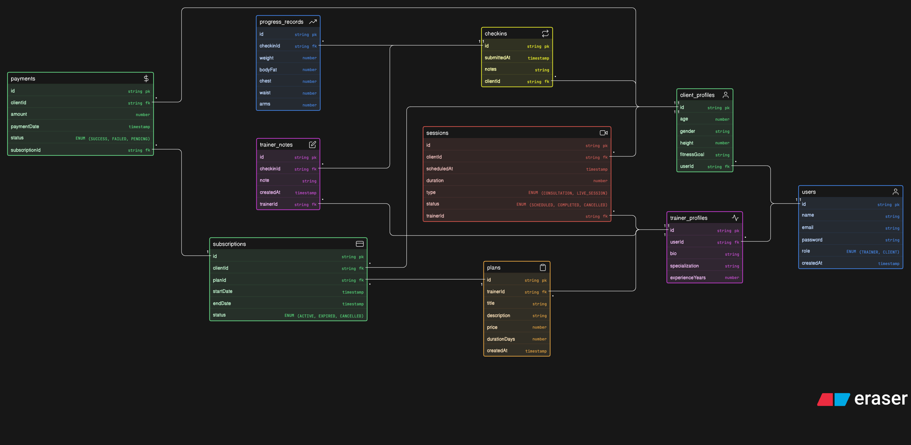

# fitness-coaching-for-influencers-erd-assignment

The platform allows trainers to manage clients, sell coaching plans, schedule sessions, track progress, and handle payments in an online coaching environment.

---

## 🧱 Core Entities

- **Users** – Base entity for both trainers and clients
- **Trainer Profiles** – Trainer-specific details
- **Client Profiles** – Client-specific details
- **Plans** – Coaching programs created by trainers
- **Subscriptions** – Links clients to purchased plans
- **Sessions** – Scheduled consultations or live sessions
- **Check-ins** – Periodic updates submitted by clients
- **Progress Records** – Structured fitness data
- **Trainer Notes** – Feedback from trainers
